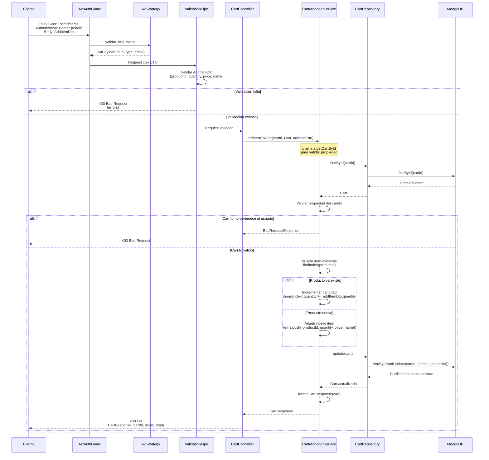

# Diagrama de Secuencia - Añadir Producto al Carrito

## Endpoint: POST /cart/:cartId/items

Diagrama de secuencia para añadir un producto al carrito. Si el producto ya existe, incrementa su cantidad.



## Flujo Detallado

1. **Autenticación y Validación**: 
   - Validación del JWT
   - Validación del DTO (productId, quantity ≥ 1, price ≥ 0, name requerido)
2. **Validación del Carrito**: Se verifica que el carrito exista y pertenezca al usuario
3. **Gestión del Item**:
   - Si el producto ya existe: se incrementa la cantidad
   - Si el producto es nuevo: se añade al array de items
4. **Actualización en MongoDB**: Se guarda el carrito actualizado
5. **Respuesta Formateada**: Se calcula el total y se retorna el carrito completo

## Request Body

```json
{
  "productId": "prod-123",
  "quantity": 2,
  "price": 29.99,
  "name": "Producto Ejemplo"
}
```

## Respuesta Ejemplo

```json
{
  "cartId": "696afadbd52f03224c802944",
  "items": [
    {
      "productId": "prod-123",
      "quantity": 3,
      "price": 29.99,
      "name": "Producto Ejemplo"
    }
  ],
  "total": 89.97
}
```

## Casos de Error

- **401 Unauthorized**: Token JWT inválido o faltante
- **400 Bad Request**: DTO inválido o carrito no pertenece al usuario
- **404 Not Found**: Carrito no encontrado
