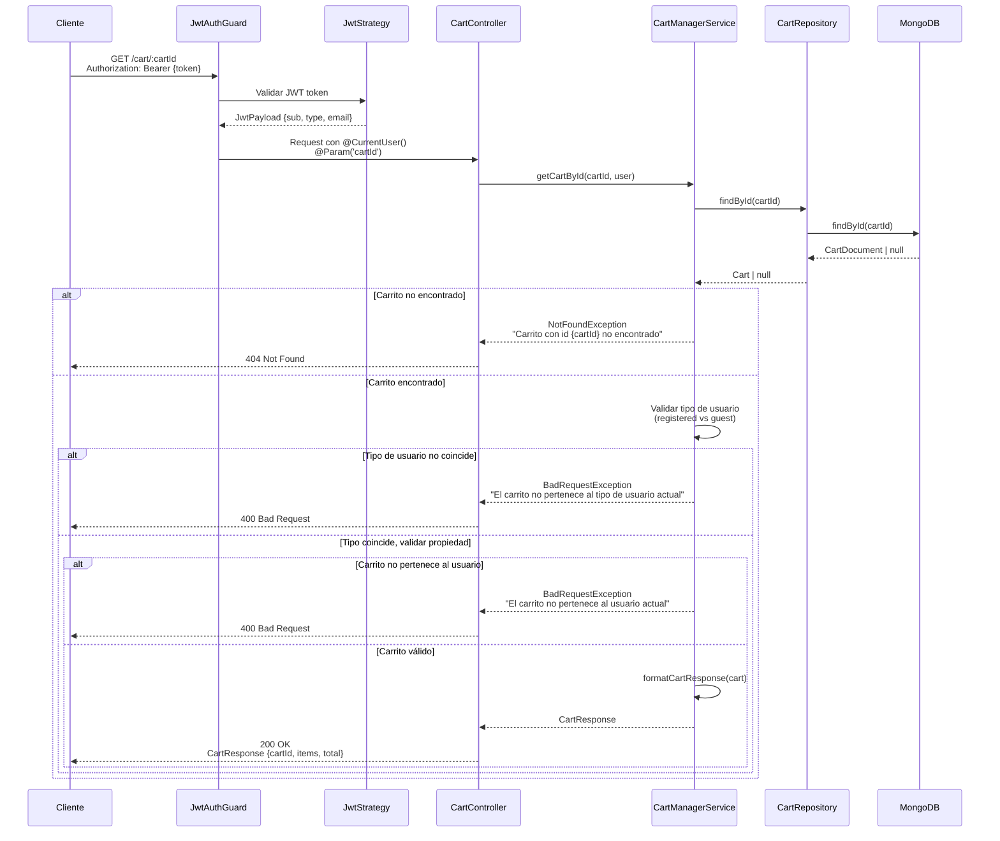

# Diagrama de Secuencia - Obtener Carrito por ID

## Endpoint: GET /cart/:cartId

Diagrama de secuencia para obtener un carrito específico validando que pertenezca al usuario.



## Flujo Detallado

1. **Autenticación**: Validación del token JWT
2. **Búsqueda por ID**: Se busca el carrito en MongoDB por su `_id`
3. **Validación de Propiedad**: 
   - Verifica que el `userType` coincida (registered/guest)
   - Verifica que el `userId` o `guestId` del carrito coincida con el del JWT
4. **Formateo de Respuesta**: Si todas las validaciones pasan, se formatea la respuesta

## Respuesta Ejemplo

```json
{
  "cartId": "696afadbd52f03224c802944",
  "items": [
    {
      "productId": "prod-123",
      "quantity": 2,
      "price": 29.99,
      "name": "Producto Ejemplo"
    }
  ],
  "total": 59.98
}
```

## Casos de Error

- **401 Unauthorized**: Token JWT inválido o faltante
- **404 Not Found**: Carrito no encontrado en MongoDB
- **400 Bad Request**: El carrito no pertenece al usuario actual
