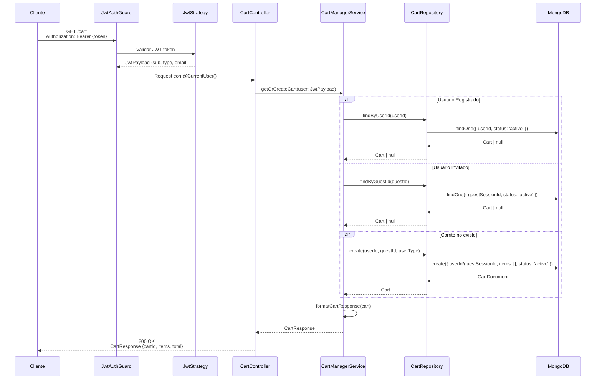

# Diagrama de Secuencia - Obtener o Crear Carrito

## Endpoint: GET /cart

Diagrama de secuencia para obtener el carrito del usuario actual o crear uno nuevo si no existe.



## Flujo Detallado

1. **Autenticación**: El JWT Guard valida el token y extrae el payload del usuario
2. **Búsqueda del Carrito**: Se busca un carrito existente según el tipo de usuario
   - Usuarios registrados: búsqueda por `userId`
   - Usuarios invitados: búsqueda por `guestSessionId`
3. **Creación si no existe**: Si no se encuentra carrito, se crea uno nuevo
4. **Formateo de Respuesta**: Se calcula el total y se formatea la respuesta

## Respuesta Ejemplo

```json
{
  "cartId": "696afadbd52f03224c802944",
  "items": [
    {
      "productId": "prod-123",
      "quantity": 2,
      "price": 29.99,
      "name": "Producto Ejemplo"
    }
  ],
  "total": 59.98
}
```

## Casos de Error

- **401 Unauthorized**: Token JWT inválido o faltante
- **500 Internal Server Error**: Error al crear o leer el carrito en MongoDB
