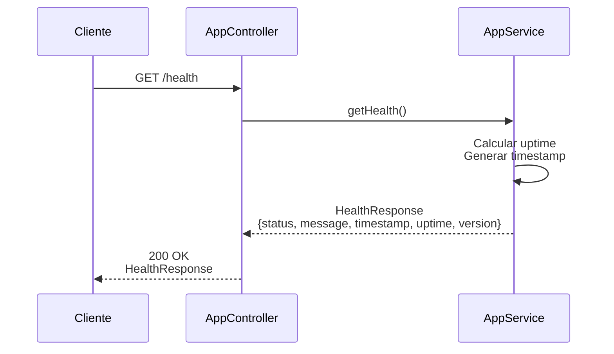

# Diagrama de Secuencia - Health Check

## Endpoint: GET /health

Diagrama de secuencia del flujo de salud del servicio.



## Respuesta Ejemplo

```json
{
  "status": "ok",
  "message": "Cart Service is running",
  "timestamp": "2026-01-17T05:00:00.000Z",
  "uptime": 3600,
  "version": "1.0.0"
}
```

## Notas

- **Sin autenticación requerida**: Este endpoint es público y no requiere JWT
- **Propósito**: Verificar que el servicio esté funcionando correctamente
- **Uso típico**: Monitoreo, health checks de load balancers, verificaciones de estado
