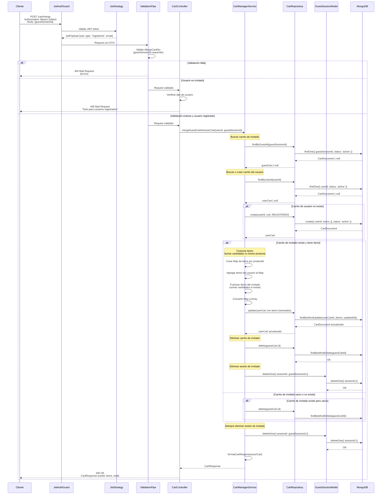

# Diagrama de Secuencia - Fusionar Carrito de Invitado

## Endpoint: POST /cart/merge

Diagrama de secuencia para fusionar el carrito de un usuario invitado con el carrito del usuario registrado.



## Flujo Detallado

1. **Autenticación y Validación**: 
   - Validación del JWT (debe ser usuario registrado)
   - Validación del DTO (guestSessionId requerido)

2. **Búsqueda de Carritos**:
   - Buscar carrito de invitado por `guestSessionId`
   - Buscar o crear carrito del usuario registrado por `userId`

3. **Fusión de Items**:
   - Si el carrito de invitado tiene items:
     - Crear un Map indexado por `productId`
     - Agregar items del carrito del usuario
     - Fusionar items del carrito de invitado:
       - Si el producto ya existe: **sumar las cantidades**
       - Si es un producto nuevo: agregarlo al Map
     - Convertir el Map de vuelta a Array

4. **Persistencia**:
   - Actualizar el carrito del usuario con los items fusionados
   - Eliminar el carrito de invitado después de la fusión

5. **Respuesta**: Retornar el carrito del usuario con todos los items fusionados

## Request Body

```json
{
  "guestSessionId": "2fa6708506a3ee01ab55f669b79eab60832ec7853043b080f84fda84770b7632"
}
```

## Ejemplo de Fusión

### Antes de la Fusión

**Carrito de Usuario (userId: "user-123"):**
```json
{
  "items": [
    { "productId": "prod-1", "quantity": 2, "price": 10.00, "name": "Producto 1" },
    { "productId": "prod-2", "quantity": 1, "price": 20.00, "name": "Producto 2" }
  ]
}
```

**Carrito de Invitado (guestSessionId: "guest-456"):**
```json
{
  "items": [
    { "productId": "prod-1", "quantity": 3, "price": 10.00, "name": "Producto 1" },
    { "productId": "prod-3", "quantity": 1, "price": 15.00, "name": "Producto 3" }
  ]
}
```

### Después de la Fusión

**Carrito del Usuario (resultado):**
```json
{
  "cartId": "user-cart-id",
  "items": [
    { "productId": "prod-1", "quantity": 5, "price": 10.00, "name": "Producto 1" }, // 2 + 3 = 5
    { "productId": "prod-2", "quantity": 1, "price": 20.00, "name": "Producto 2" },
    { "productId": "prod-3", "quantity": 1, "price": 15.00, "name": "Producto 3" } // Nuevo
  ],
  "total": 85.00
}
```

**Carrito de Invitado**: ❌ Eliminado

## Respuesta Ejemplo

```json
{
  "cartId": "696afadbd52f03224c802944",
  "items": [
    {
      "productId": "prod-1",
      "quantity": 5,
      "price": 10.00,
      "name": "Producto 1"
    },
    {
      "productId": "prod-2",
      "quantity": 1,
      "price": 20.00,
      "name": "Producto 2"
    }
  ],
  "total": 70.00
}
```

## Casos de Error

- **401 Unauthorized**: Token JWT inválido o faltante
- **400 Bad Request**: 
  - DTO inválido (guestSessionId faltante)
  - Usuario es invitado (solo usuarios registrados pueden fusionar)
- **404 Not Found**: Carrito de invitado no encontrado (no es error, simplemente no hay nada que fusionar)

## Notas Importantes

- ✅ **Solo usuarios registrados** pueden usar este endpoint
- ✅ Si hay productos duplicados, **se suman las cantidades**
- ✅ El carrito de invitado **se elimina automáticamente** después de la fusión
- ✅ La sesión de invitado en **GUEST_SESSIONS se elimina** después de la fusión
- ✅ Si el carrito de invitado está vacío, solo se elimina sin modificar el del usuario
- ✅ Si el usuario no tiene carrito, se crea uno nuevo con los items del invitado
