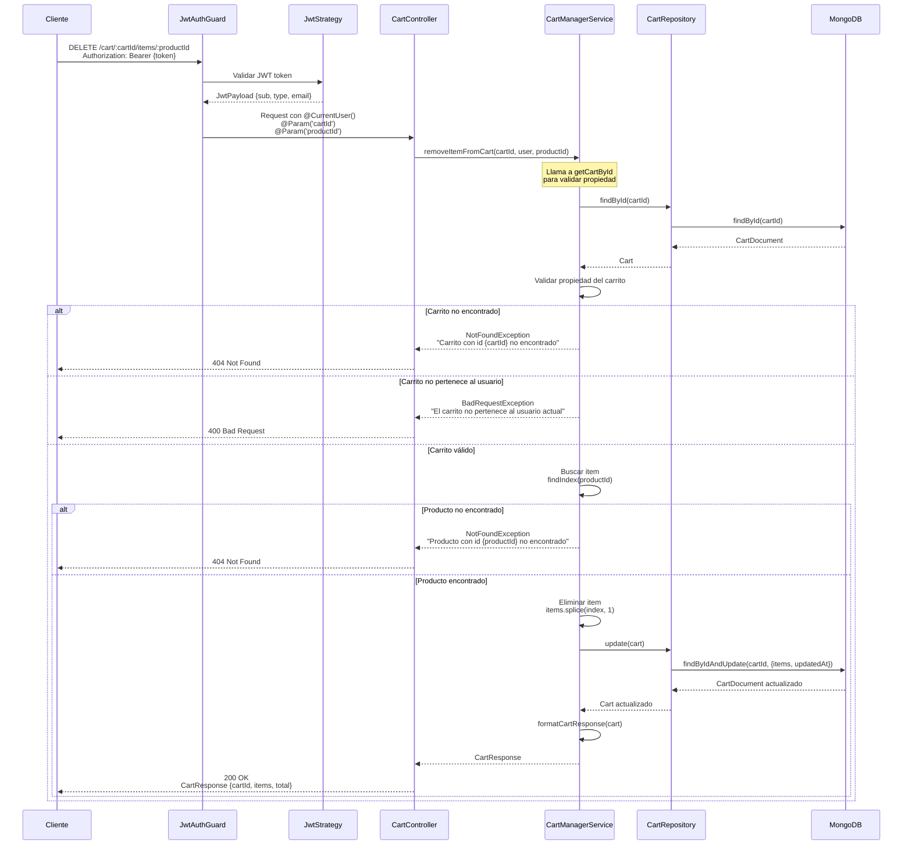

# Diagrama de Secuencia - Eliminar Producto del Carrito

## Endpoint: DELETE /cart/:cartId/items/:productId

Diagrama de secuencia para eliminar un producto del carrito completamente.



## Flujo Detallado

1. **Autenticación**: Validación del token JWT
2. **Validación del Carrito**: 
   - Se busca el carrito por ID
   - Se verifica que exista y pertenezca al usuario
3. **Búsqueda del Producto**: Se busca el producto en el array de items
4. **Eliminación**: Si se encuentra, se elimina del array usando `splice()`
5. **Persistencia**: Se guarda el carrito actualizado en MongoDB
6. **Respuesta**: Se retorna el carrito completo con el total recalculado

## Respuesta Ejemplo

Si el carrito tenía 2 productos y se elimina uno:

```json
{
  "cartId": "696afadbd52f03224c802944",
  "items": [
    {
      "productId": "prod-456",
      "quantity": 1,
      "price": 19.99,
      "name": "Otro Producto"
    }
  ],
  "total": 19.99
}
```

## Casos de Error

- **401 Unauthorized**: Token JWT inválido o faltante
- **400 Bad Request**: El carrito no pertenece al usuario actual
- **404 Not Found**: Carrito o producto no encontrado

## Notas

- La eliminación es permanente: el producto se remueve completamente del carrito
- El total se recalcula automáticamente después de la eliminación
- Si el carrito queda vacío, el array `items` será `[]` y el `total` será `0`
