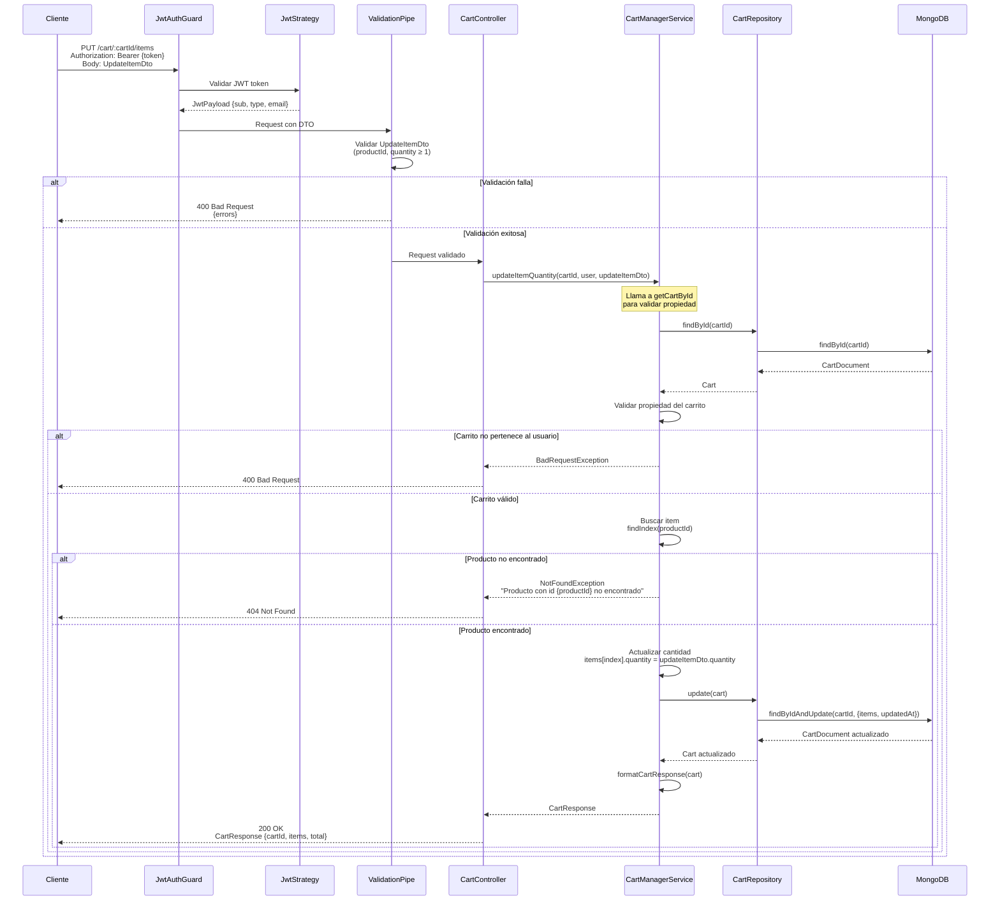

# Diagrama de Secuencia - Actualizar Cantidad de Producto

## Endpoint: PUT /cart/:cartId/items

Diagrama de secuencia para actualizar la cantidad de un producto específico en el carrito.



## Flujo Detallado

1. **Autenticación y Validación**: 
   - Validación del JWT
   - Validación del DTO (productId requerido, quantity ≥ 1)
2. **Validación del Carrito**: Se verifica que el carrito exista y pertenezca al usuario
3. **Búsqueda del Producto**: Se busca el producto en el array de items del carrito
4. **Actualización**: Se actualiza la cantidad del producto encontrado
5. **Persistencia**: Se guarda el carrito actualizado en MongoDB
6. **Respuesta**: Se retorna el carrito completo con el total actualizado

## Request Body

```json
{
  "productId": "prod-123",
  "quantity": 5
}
```

## Respuesta Ejemplo

```json
{
  "cartId": "696afadbd52f03224c802944",
  "items": [
    {
      "productId": "prod-123",
      "quantity": 5,
      "price": 29.99,
      "name": "Producto Ejemplo"
    }
  ],
  "total": 149.95
}
```

## Casos de Error

- **401 Unauthorized**: Token JWT inválido o faltante
- **400 Bad Request**: DTO inválido o carrito no pertenece al usuario
- **404 Not Found**: Carrito o producto no encontrado en el carrito
